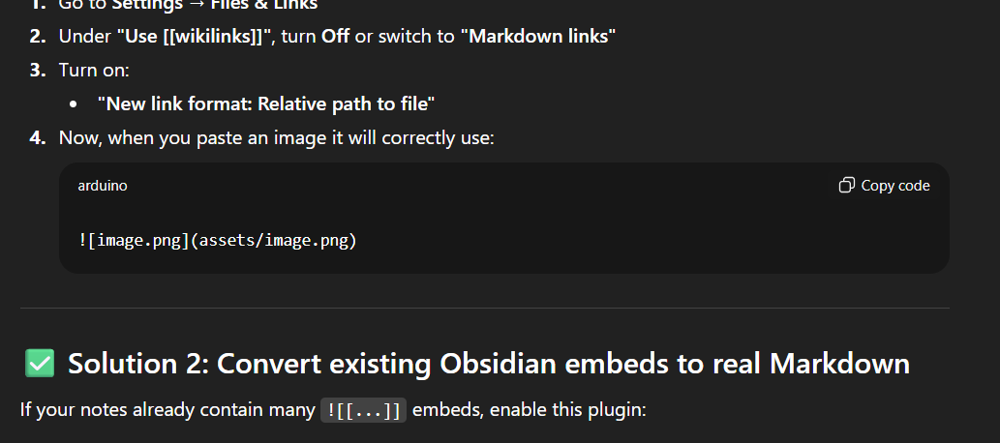

___
## The Windows API

- Application Programming Interface (API)
- Mechanism to interface with the Windows operating system
- "Mostly" described by the Microsoft Developer Network (MSDN) - Some functions are not officially documented
- Comprised of functions, structures and constants - Including Windows defined data types
- Dynamic entity which can change and expand between releases
- Official implementation is on your Windows machine (in DLLs)
- Ctypes enables us to wrap Python around C - "Speaking C" lets us interface with the Windows API
- Hacker focused API calls - OpenProcess, CreateRemoteThread, WriteProcessMemory

